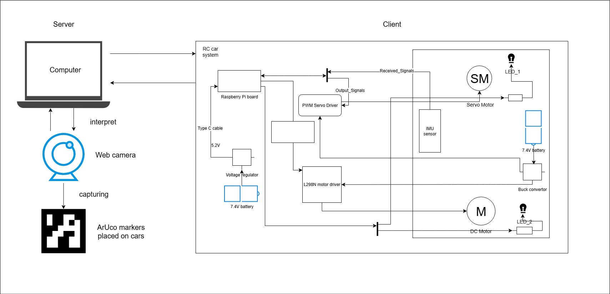

# Cyber-Physical Systems Project: Heterogenous Autonomous RC car platform
Main Author(s) of the Project: **Darius Loga**

## Table of Contents
- [Overview](#overview)
- [System Architecture](#system-architecture)
- [Installation](#installation--usage)
- [Simulations / Demos](#simulations--demos)
- [Configuration](#configuration)
- [Dependencies](#dependencies)
- [Data Logging & Evaluation](#data-logging--evaluation)
- [Contributing](#contributing)
- [License](#license)

## Overview
A physical platform for adaptive coordination of heterogenous RC cars using ArUco markers to locate the track and to communicate between systems.

## System Architecture
This is the architecture for the Client side (Raspberry Pi based system), one RC car used as a Proof of Concept *(PoC)* to see if this can be an accepted architecture and derive from this to create other ones (mainly heterogenous in terms of additional sensors, but homogenous in terms of RC car's hardware, at least for 2-3 models). For the Server side (computer), it is just to run some Python scrips and some other computations to reduce the workload on the RC car.
> - Systems: Different models (custom/prebuilt) of RC cars  
> - Environment: Custom-build track with curves and two lines
> - Control: Autonomous driving using ArUco markers and overview camera
> - Interface: Python with image recognition and filtering

<figure>
  
  <figcaption style="text-align:center">First iteration of the Black Box of one RC car system - done on paper</figcaption>
</figure>
<figure>
  
  <figcaption style="text-align:center">Final iteration of the Black Box of one RC car system - done on paper</figcaption>
</figure>
<figure>
  
  <figcaption style="text-align:center">Final iteration of the Black Box of one RC car system - simplified version</figcaption>
</figure>
<figure>
  
  <figcaption style="text-align:center">First stage of the Black Box of the platform - simplified version</figcaption>
</figure>
<figure>
  
  <figcaption style="text-align:center">Final stage of the Black Box of the platform - WIP</figcaption>
</figure>


## Installation & Usage
Step-by-step instructions to set up the environment of the project and run, at this stage, only the manual control.

```bash
# Clone the repository and place in the correct working folder
git clone https://github.com/Cyber-physical-Systems-Lab/heterogenous-autonomous-rc-car-platform.git
cd heterogenous-autonomous-rc-car-platform
# pip install -r requirements.txt - going to be added later
```

Run [update_firmware.py](../heterogenous-autonomous-rc-car-platform/update_firmware.py) on the server (computer) connected to the same network as the Client (RasPi board) to transfer one Python file (*car.py*) to run on the Client side:
```bash
# Where -n is to select IDs of the RC cars to be manually controlled. Default operation is set to `Manual`.
python update_firmware.py -n ID
```

Instructions on how to run the system itself (running on the server side and automatically starting the *car.py* on selected RC cars based on the ID).

```bash
# Example: Run the main simulation
python player_launcher.py -n <cars> -c <controller> 
# Replace <cars> with the numbers of the cars to be controlled and <controller> with the controller to be used. The current available controllers are `Keyboard` and `Joystick` (defaulted to `Keyboard`).

# Example of the command:
# Control minicar 3 with the joystick:

python player_launcher.py -n 3 -c Joystick

# Control minicars 0, 1, 2, 7 and 10 with the keyboard:

python player_launcher.py -n 0 1 2 7 10
```
### Notes
`<username>` and `<password>` on line 45 of [player_launcher.py](player_launcher.py) and line 28 of
[update_firmware.py](update_firmware.py) must be replaced with the username and password of the Raspberry Pi.

The default IP addresses of the minicars are `192.168.2.2<id>`, where `<id>` is the car ID(00-99). To change this, 
modify line 29 in [player_launcher.py](player_launcher.py) and line 24 in [update_firmware.py](update_firmware.py). Right now, it is hardcoded, but it should be a function to ge the IP addresses automatically. 

The inputs have to be rebound for the joystick in [binds.py](player/binds.py).


## Simulations / Demos
For the simulation, three main operation modes are taken into consideration: `Manual`, `Semi-Autonomous` and `Autonomous`. For the manual mode, some keyboards/joystick buttons that are used in order to make the RC car run. The other modes are currently under development.

- Operation mode 1: Manual
    - key `W` for forward/acceleration
    - key `S` for backwards/deceleration
    - key `A` for turning left
    - key `D` for turning right
    - combo key `W` + `S` for breaking/reducing speed to 0
    - it works to turn and accelerate/decelerate at the same time
- Operation mode 2: Semi-Autonomous
    - key `W` for forward/acceleration
    - key `S` for backwards/deceleration
    - it will work autonomous to turn left/right
- Operation mode 3: Autonomous
    - it will work autonomous to turn accelerate/decelerate
    - it will work autonomous to turn left/right

<div align="center" style="text-align:center">
  <video src="https://github.com/user-attachments/assets/6150c044-8af5-4b17-b8e0-f4195084903a" alt="Manual video demonstration" controls></video>
  
  Manual Operation Mode
</div>


## Configuration
There are some `.txt` files that need to be in order to execute some commands.

>Config file: `update_firmware.txt`
>```
>put <file_path>
>```
just to be able to transfer the file from the host PC (Server) to the Raspberry Pi board (Client).

>
>Config file: `launch.txt`
>```
>sudo python -u <file_path>
>```
for this version of code that is to be run on the Pi board itself, it needs to have `sudo` and `-u` parameter to runs python in unbuffered mode to not wait for flushing to see the text afterwards, but to simulate a real-time display, especially if you want to save logs to an external file.


## Dependencies
List core software, libraries and versions used:
>- Python 3.10
>- RPi.GPIO, busio, adafruit_bno055, rpi_hardware_pwm
>- PyGame, NumPy, OpenCV2, Keyboard, sys
>- threading, socket, argparse

## Data Logging & Evaluation
I wanted some data to be logged just in case some unusual behaviours might appear and further looking into some `print()` might be a good place to start and not to go through console.

>Logs stored in different folder for different purposes:
>   - `firmware/` - data about car logs about the on-board sensors.
>   - `player/` - what types of keys were pressed to have a behaviour achieve and to easily identify any bugs or misbehaviour.

## Contributing
Contact the main author(s), if you are interested in continuing this research project and support as much as you can and like.

> - List of Contributors/Maintainers (active and non-active): Darius Loga 
> - Fork/Clone the repo  
> - Create feature/developer branches  
> - Submit via Pull Request (tag the owner to get notified about those changes)
> - Wait for review (if the owner is still a contributor/maintainer)
>   - if not, you can push those changes into the `main` branch

## License
MIT License

Copyright (c) 2025 Cyber-physical Systems Lab at Uppsala University

Permission is hereby granted, free of charge, to any person obtaining a copy
of this software and associated documentation files (the "Software"), to deal
in the Software without restriction, including without limitation the rights
to use, copy, modify, merge, publish, distribute, sublicense, and/or sell
copies of the Software, and to permit persons to whom the Software is
furnished to do so, subject to the following conditions:

The above copyright notice and this permission notice shall be included in all
copies or substantial portions of the Software.

THE SOFTWARE IS PROVIDED "AS IS", WITHOUT WARRANTY OF ANY KIND, EXPRESS OR
IMPLIED, INCLUDING BUT NOT LIMITED TO THE WARRANTIES OF MERCHANTABILITY,
FITNESS FOR A PARTICULAR PURPOSE AND NONINFRINGEMENT. IN NO EVENT SHALL THE
AUTHORS OR COPYRIGHT HOLDERS BE LIABLE FOR ANY CLAIM, DAMAGES OR OTHER
LIABILITY, WHETHER IN AN ACTION OF CONTRACT, TORT OR OTHERWISE, ARISING FROM,
OUT OF OR IN CONNECTION WITH THE SOFTWARE OR THE USE OR OTHER DEALINGS IN THE
SOFTWARE.
