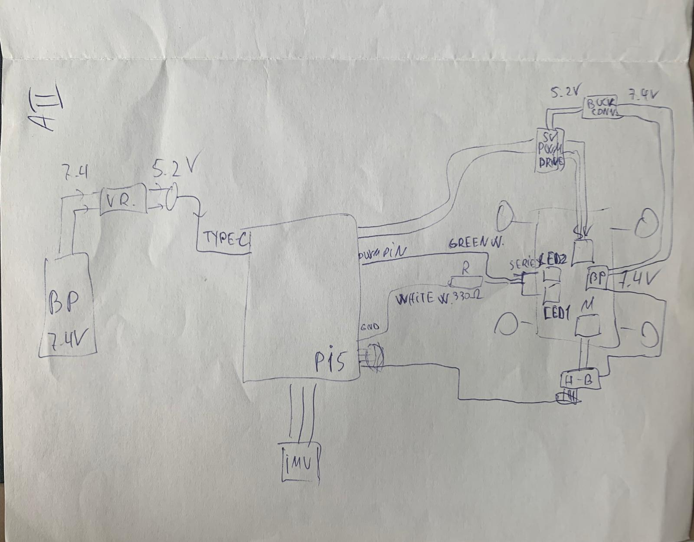
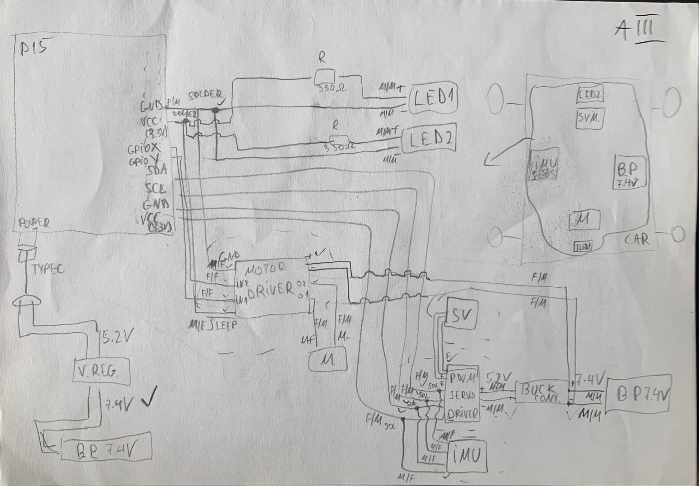
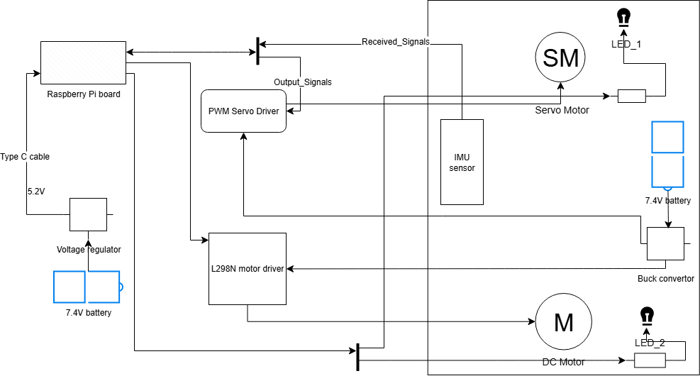
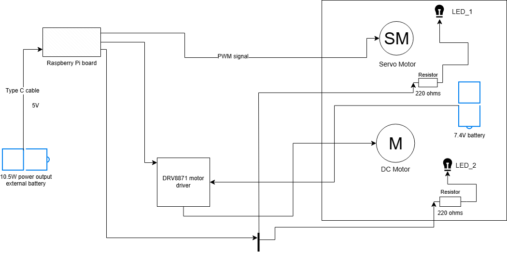
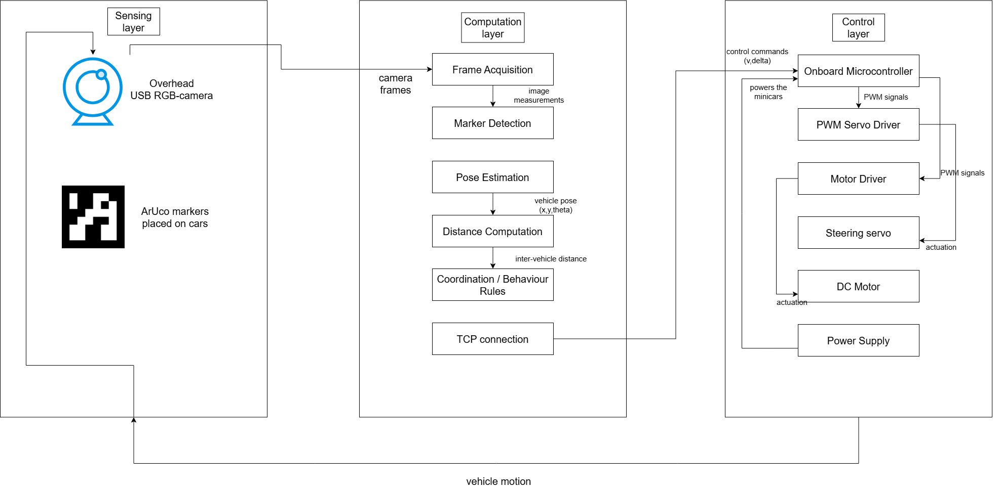
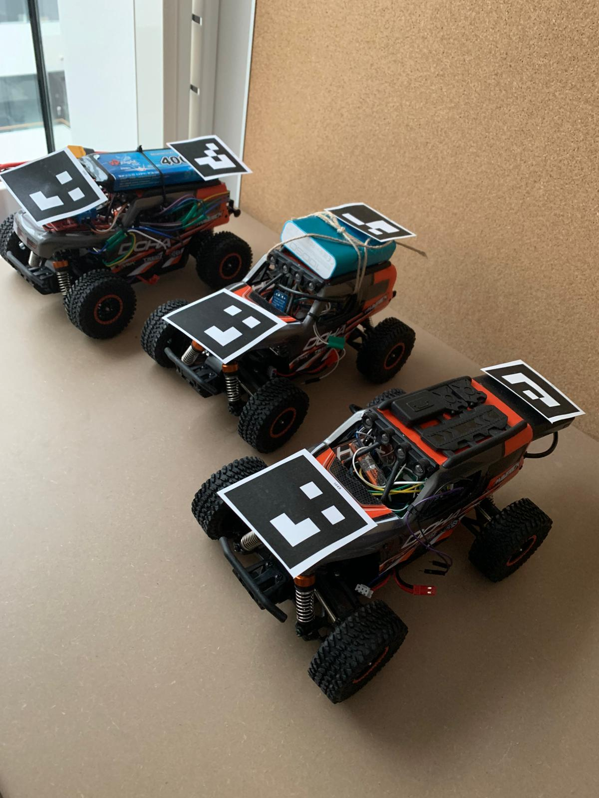
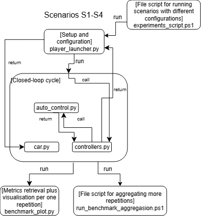

# Master Thesis Project – Cyber-Physical Systems at Uppsala University
Design of a Research Platform for Mini Autonomous Cars

Main author of the Master Thesis Project: **Darius Loga**

This repository contains the code and resources for a low-cost, centralised, vision-based research platform for cooperative driving experiments with 1/20‑scale RC minicars. The platform combines a single overhead RGB camera, ArUco markers, and a central base-station that estimates vehicle state and coordinates multiple minicars on a small-scale indoor freeway track.

The work corresponds to a master’s thesis, and focuses on:

- Designing a modular, reproducible testbed for cooperative driving.
- Implementing a centralised camera-based localisation and coordination pipeline.
- Evaluating how camera configuration and behaviour-based policies affect safety, robustness, and efficiency in multi-vehicle scenarios.

---

## Table of Contents
- [Overview](#overview)
- [System Architecture](#system-architecture)
- [Installation](#installation--usage)
- [Simulations / Demos](#simulations--demos)
- [Configuration](#configuration)
- [Dependencies](#dependencies)
- [Data Logging & Evaluation](#data-logging--evaluation)
- [Contributing](#contributing)
- [License](#license)

---

## Overview
This project provides a physical platform for cooperative and experimental driving with mini RC cars using:

- A single overhead RGB camera observing the full track.
- ArUco fiducial markers for localisation.
- A central base-station that runs vision, coordination, and logging.
- A fleet of 1/20‑scale minicars connected over the network.

The platform is used to study freeway-inspired scenarios such as lane-keeping, car-following, lane changes, yielding, queuing, and bottlenecks. The focus is on **centralised, rule-based coordination under limited sensing**, rather than on heavy onboard autonomy.

The repository contains:

- Python scripts to control one or multiple minicars (manual, semi-autonomous, and autonomous modes).
- Firmware-deployment helpers for Raspberry Pi boards on the cars.
- Configuration files for launching firmware and control scripts over SSH.
- Logging infrastructure to capture both onboard sensor information and user commands.

---

## System Architecture

At a high level, the platform follows a **centralised sense–plan–act architecture**:

- **Sensing layer**  
  A single overhead USB/RGB camera views the entire track. Each minicar carries an ArUco marker which is detected in each frame to estimate the car’s planar pose \((x, y, \theta)\).

- **Computation layer (base-station)**  
  A central computer:
  - Receives camera frames.
  - Runs ArUco detection and pose estimation.
  - Computes inter-vehicle and vehicle–obstacle distances.
  - Applies rule-based coordination policies (e.g. cooperative vs non-cooperative), mapping distances and context into speed and steering commands.

- **Control layer (minicars)**  
  Each minicar:
  - Runs Python firmware on a Raspberry Pi board.
  - Receives commands over the network (e.g. via `player_launcher.py` and `car.py`).
  - Converts speed and steering commands into low-level actuation (GPIO, PWM, etc.).
  - Logs local sensor data for later analysis.

Conceptually, the minicar system is first developed as a Proof of Concept (PoC) for one car, then extended to multiple heterogeneous cars that share a common control and communication architecture.

The `media/images/` folder contains architectural diagrams that illustrate:

- Early and final “black box” diagrams for a single RC car system.
- Early and current platform-level architecture for the multi-car setup.

<figure>
  <center></center>
  <figcaption style="text-align:center">First iteration of the Black Box of one RC car system - done on paper</figcaption>
</figure>
<figure>
  <center></center>
  <figcaption style="text-align:center">Final iteration of the Black Box of one RC car system - done on paper</figcaption>
</figure>
<figure>
  <center></center>
  <figcaption style="text-align:center">Final iteration of the Black Box of the PoC RC car system - simplified version</figcaption>
</figure>
<figure>
  <center></center>
  <figcaption style="text-align:center">Final iteration of the Black Box of one of the other RC car system - simplified version</figcaption>
</figure>
<figure>
  <center></center>
  <figcaption style="text-align:center">Final version of the Black Box of the platform</figcaption>
</figure>

---

## Installation & Usage

### 1. Clone the repository

```bash
# Clone the thesis research platform repository
git clone https://github.com/Cyber-physical-Systems-Lab/master-thesis-research-platform-minicars.git
cd master-thesis-research-platform-minicars
```

> The repository is intended to run on a Linux machine (or WSL) but can easily run on Windows too for the base-station and on Raspberry Pi boards on the minicars.

### 2. Python environment

Create a virtual environment and install dependencies:

```bash
python -m venv .venv
source .venv/bin/activate   # on Windows: .venv\Scripts\activate
# requirements.txt is under preparation / update
# pip install -r requirements.txt
```

At this stage, the base-station components primarily rely on:

- Python 3.10
- Standard networking and threading libraries
- PyGame and keyboard input for manual operation
- OpenCV for camera and marker-based localisation (when enabled)

### 3. Firmware deployment to minicars

Use `update_firmware.py` on the base-station to transfer the minicar firmware (e.g. `car.py`) to one or more Raspberry Pi boards on the cars.

```bash
# Run from the repo root on the base-station machine
# -n is used to select IDs of the RC cars to be updated/controlled.
python update_firmware.py -n ID
```

The script connects to the specified Raspberry Pi boards over SSH and deploys the configured firmware file, using the settings provided in the configuration section of this README.

### 4. Launching the control program

To control one or multiple minicars from the base-station, use `player_launcher.py`. This script connects to the selected cars, launches the `car.py` program on the Raspberry Pis, and handles keyboard or joystick commands for manual, semi-autonomous, or autonomous operations.

```bash
# Example: run the main control script
python player_launcher.py -n <cars> -c <controller>

# Replace <cars> with the IDs of the cars to be controlled and <controller>
# with the controller to be used. The current available controllers are:
#   - Keyboard  (default)
#   - Joystick

# Example commands:

# Control minicar 3 with a joystick:
python player_launcher.py -n 3 -c Joystick

# Control minicars 0, 1, 2, 7 and 10 with the keyboard:
python player_launcher.py -n 0 1 2 7 10
```

---

## Simulations / Demos

The platform currently exposes three high-level **operation modes** for the minicars. These modes are primarily used for testing the platform and demonstrating capabilities; the full thesis experiments build on top of these control pipelines.

<figure>
  <center></center>
  <figcaption style="text-align:center">Image with the actual physical models of the minicars</figcaption>
</figure>

### Operation mode 1: Manual

In **Manual** mode, the platform acts as a remote-control gateway:

- Use the keyboard or a joystick to control one or multiple minicars.
- Basic bindings for keyboard:
  - `W` – accelerate / forward
  - `S` – decelerate / reverse
  - `A` – steer left
  - `D` – steer right
  - `W` + `S` – braking / reducing speed to zero
- Steering and speed commands can be combined (e.g. steering while accelerating).

This mode is particularly useful for:

- Testing connectivity and firmware.
- Calibrating motor and steering ranges.
- Manual exploration of the track and environment.

A short demonstration video showing manual operation is embedded below:

<div align="center" style="text-align:center">
  <video src="https://github.com/user-attachments/assets/6150c044-8af5-4b17-b8e0-f4195084903a" alt="Manual video demonstration" controls></video>
  
  Manual Operation Mode
</div>

### Operation mode 2: Semi-Autonomous

In **Semi-Autonomous** mode:

- The operator still controls longitudinal motion (acceleration/braking) using `W` and `S`.
- The system assists or takes over lateral control to turn left/right, e.g. towards lane keeping or simple waypoint following.

This mode is intended as a stepping stone towards full autonomy and can be used to test simple visual or rule-based lateral controllers while keeping speed control manual.

### Operation mode 3: Autonomous

In **Autonomous** mode (under active development):

- The system aims to control both acceleration/deceleration and steering autonomously.
- Decisions are derived from the centralised vision+coordination pipeline, including:
  - Lane keeping and path tracking.
  - Car-following and gap maintenance.
  - Yielding, queueing, and stopping near bottlenecks.

In the thesis context, autonomous operation is evaluated in freeway-inspired scenarios (S1–S4) at small scale, where the platform acts as a centralised controller that uses an overhead camera and markers to coordinate multiple cars.

A short demonstration video showing autonomous operation is embedded below:

<div align="center" style="text-align:center">
  <video src="media\videos\S1-coop-90-nocalib.mp4" alt="Autonomous video demonstration" controls></video>
  
  Autonomous Operation Mode
</div>

---

## Configuration

Several configuration files and constants control how firmware is deployed and how the cars are launched. These are simple text files that the scripts read and interpret.

### 1. Firmware deployment configuration

Configuration file: `update_firmware.txt`

```text
put <file_path>
```

This instructs the firmware deployment script which file to transfer from the base-station (host PC) to the Raspberry Pi board (client).

### 2. Launch configuration on the Raspberry Pi

Configuration file: `launch.txt`

```text
sudo python -u <file_path>
```

The `sudo` and `-u` flags are used to:

- Run the Python script with sufficient privileges for GPIO access (if needed).
- Run Python in unbuffered mode so output is flushed immediately, which is useful for real-time logging and debugging.

### 3. Credentials and IP addresses

Some fields in the scripts must be customised for your environment:

- The default IP addresses of the minicars follow the pattern:

  ```text
  192.168.2.2<id>
  ```

  where `<id>` is the car ID (00–99).

They are intended to be discovered automatically (e.g. configuration files) based on the IPs connected through the sockets identified by the python script `player_launcher.py`.

### 4. Input bindings

The joystick and keyboard bindings can be customised in:

- `player/binds.py`

This allows you to remap buttons and keys to steering and throttle actions that match your hardware and user preferences.

---

## Dependencies

Core software, libraries and versions used:

- **Language & runtime**
  - Python 3.10

- **Raspberry Pi / hardware**
  - `RPi.GPIO`
  - `busio`
  - `adafruit_bno055`
  - `rpi_hardware_pwm`

- **Base-station & control**
  - `pygame` (for joystick and keyboard input)
  - `numpy`
  - `opencv-python` (OpenCV)
  - `keyboard`
  - `sys`, `threading`, `socket`, `argparse` (standard library)

Install these either via `pip` or using a `requirements.txt` (to be kept up to date with the actual set of imports in the repository).

---

## Data Logging & Evaluation

The platform logs data both on-board the minicars and on the base-station to support debugging, analysis, and reproducible experiments.

- **On-board logs (firmware-side)**  
  Stored under a directory such as:

  - `firmware/` – logs produced by the firmware running on the Raspberry Pi, including sensor readings, status messages, and exceptions.

- **Player / control logs (base-station)**  
  Stored under a directory such as:

  - `player/` – logs of key presses or joystick actions and high-level control events. These logs are useful for:
    - Reconstructing manual driving behaviour.
    - Identifying misbehaviour or unexpected responses.
    - Comparing different control modes and configurations.

In the thesis, these logs are used to derive metrics such as:

- Tracking accuracy and error distributions.
- Safety events (e.g. near-misses vs collisions).
- Waiting times in bottleneck and queueing scenarios.

While only a subset of logs may be included directly in the repository, the logging format is designed to support offline recomputation of summary tables and figures.

### 1. Experimental Results & Reproducible Plots

The platform is not only an implementation artifact but also a complete experimental pipeline for the thesis. The recorded logs are used to generate tables and plots that appear in the Results and Analysis chapters of the thesis, and the same outputs can be reproduced from this repository.

<figure>
  <center></center>
  <figcaption style="text-align:center">Scenarios (S1--S4) Pipeline</figcaption>
</figure>

#### 1.1. Scenarios and metrics

Experiments are organised around four freeway-inspired scenarios:

- **S1 – Single-vehicle lane keeping**  
  Basic tracking of an oval lane with one minicar, used to validate the sensing–control loop without interactions.

- **S2 – Two-vehicle car-following**  
  Leader–follower experiment with speed changes, used to test distance-keeping and braking behaviour.

- **S3 – Multi-vehicle merging / lane changing**  
  Several minicars pass a bottleneck with a static obstacle, used to evaluate coordination under spatial constraints.

- **S4 – Cooperative vs non-cooperative bottleneck traffic**  
  Multi-vehicle interaction with explicit policy comparison, used to study safety and mean waiting time under the same sensing and hardware conditions.

For each scenario, the analysis uses a fixed set of metrics:

- **Pose tracking error**: how closely the estimated planar pose \((x, y, \theta)\) follows a reference trajectory over time.
- **Inter-vehicle distance error**: absolute error between vision-based distance and reference distance, crucial for safety-aware coordination.
- **Safety event rates**: frame-normalised collision rate and near-miss rate based on thresholds \(d_{\text{col}}, d_{\text{warn}}, d_{\text{safe}}\).
- **Mean waiting time**: how long a vehicle remains in an interaction zone (bottleneck/queue) before it can proceed safely.

These metrics are computed offline from the same JSON logs that drove the controller, ensuring that all figures and tables can be regenerated from raw data.

#### 1.2. Log naming and organisation

Logs produced by the autonomous controller follow a structured naming convention, for example:

```text
exp-log-{Scenario}-r{Repetition}-{dfov}fov-{HeightCM}cm-{calib|non-calib}-{Policy}.json
```

where:

- `{Scenario}`: S1, S2, S3 or S4.
- `{Repetition}`: integer run index.
- `{dfov}`: diagonal field-of-view tag (e.g. 90 or 78 degrees).
- `{HeightCM}`: measured camera height.
- `{calib|non-calib}`: whether a calibration file was used.
- `{Policy}`: cooperative or non_cooperative.

Files are stored under:

```text
./exp/{Scenario}/
```

with optional subfolders for run names, so that different experimental conditions can be identified and grouped without opening the JSON content.

#### 1.3 Benchmarking and plot generation

Offline evaluation and visualisation are handled by the benchmarking script in the `exp/` folder (e.g. `exp/benchmark_plot.py`). This script:

- Reads one or more JSON log files.
- Recomputes pose and distance errors, safety events, waiting times, lane assignments, and emergency-stop flags.
- Generates a fixed set of charts and summary tables for each run.

For a single log file, you can run:

```bash
python exp/benchmark_plot.py --input exp/S4/exp-log-S4-r1-90fov-150cm-calib-cooperative.json
```

This produces plots and tables under an output directory derived from the log metadata, for example:

```text
./exp/results/{scenario}-{dfov}dFOV-{calib}-{policy}/
```

Key plots include:

- Time-series of lateral and heading error.
- Minicar–object and minicar–minicar distance plots with threshold bands.
- Pie charts of safety events (collision vs near-miss vs safe), split by source (vehicle vs obstacle).
- Command time-series (servo and motor values).
- Waiting-time bar charts per scenario and policy.
- Lane timelines and trajectory coverage plots.
- Emergency-stop timelines.

For multi-run comparisons (e.g. cooperative vs non-cooperative policy under the same camera configuration), the script aggregates metrics into shared folders such as:

```text
./exp/results/{scenario}-{dfov}dFOV-{calib}-{pol_or_multi}/
```

and produces policy-comparison bar charts and Markdown/CSV summary tables suitable for direct inclusion in the thesis or other reports.

#### 1.4 Overall results for the experimental scenarios

The experimental results quantify both localisation accuracy and traffic behaviour across the four freeway-inspired scenarios (S1–S4). For S1–S3, we report mean lateral/heading errors and typical minicar–minicar and minicar–obstacle gaps, aggregated over camera geometries and repetitions, while the S4 tables compare cooperative and non-cooperative policies in a three-minicar bottleneck via gap statistics, frame-normalised safety-event rates, and mean waiting times. Together, these metrics show how camera configuration and coordination policy jointly shape tracking quality, obstacle interactions, and waiting-time patterns for the platform.

##### Pose and distance metrics (S1–S3)
| Scenario                 | Mean lateral error (px) | Mean heading error (°) | Typical mean gap (cm) | Typical obstacle distance (cm) |
|--------------------------|-------------------------|------------------------|------------------------|---------------------------------|
| S1 (Single minicar)      | 35.2                    | 12.6                   | --                     | --                              |
| S2 (Car-following)       | 24.5                    | 10.6                   | 45–58                  | --                              |
| S3 (Merging + obstacles) | 50.6                    | 12.0                   | 57–60                  | 12–17                           |

---
##### Camera configuration vs tracking accuracy (S1–S3)

| Camera configuration                      | Mean lateral error (px) | Mean heading error (°) |
|-------------------------------------------|-------------------------|------------------------|
| 78° FOV, 220 cm (calibrated)              | 36.7                    | 11.5                   |
| 78° FOV, 220 cm (not calibrated)          | 24.8                    | 9.5                    |
| 90° FOV, 170 cm (calibrated)              | 39.0                    | 11.6                   |
| 90° FOV, 170 cm (not calibrated)          | 42.1                    | 13.1                   |

---

##### Scenario S4 – 78° FOV at 220 cm (non-calibrated)

| Eval. metric              | Metric                                | Car 0  | Car 1  | Car 2  |
|---------------------------|----------------------------------------|--------|--------|--------|
| Pose tracking error       | Mean lateral error (px)                | 76.1   | 33.6   | 41.7   |
|                           | Mean heading error (°)                 | 8.8    | 10.3   | 14.5   |
| Distance estimation       | Mean minicar–minicar gap (cm)         | 58.3   | 63.4   | 70.3   |
|                           | Mean minicar–obstacle distance (cm)   | 10.7   | 10.3   | 15.5   |
| Safety events             | Collision rate (per frame)            | 0.053  | 0.153  | 0.341  |
|                           | Near-miss rate (per frame)            | 0.417  | 0.664  | 0.601  |
|                           | Emergency-stop rate (per frame)       | 0.171  | 0.162  | 0.343  |
| Mean waiting time         | Mean waiting time (s)                  | 15.3   | 12.8   | 16.3   |

##### Scenario S4 – 78° FOV at 220 cm (non-cooperative policy)

| Eval. metric              | Metric                                | Car 0  | Car 1  | Car 2  |
|---------------------------|----------------------------------------|--------|--------|--------|
| Pose tracking error       | Mean lateral error (px)                | 29.9   | 18.8   | 39.0   |
|                           | Mean heading error (°)                 | 5.5    | 5.9    | 13.0   |
| Distance estimation       | Mean minicar–minicar gap (cm)         | 72.9   | 73.5   | 61.1   |
|                           | Mean minicar–obstacle distance (cm)   | 19.2   | 13.4   | 15.8   |
| Safety events             | Collision rate (per frame)            | 0.013  | 0.171  | 0.274  |
|                           | Near-miss rate (per frame)            | 0.362  | 0.603  | 0.442  |
|                           | Emergency-stop rate (per frame)       | 0.097  | 0.254  | 0.287  |
| Mean waiting time         | Mean waiting time (s)                  | 16.7   | 15.8   | 8.3    |

---

## Contributing

Contributions and extensions are welcome, especially if you are interested in:

- Testing new coordination policies (e.g. more advanced rule sets or optimisation-based controllers).
- Adding additional sensing modalities to the minicars.
- Improving the deployment and configuration tooling.

Basic contribution guidelines:

- Contact the main author(s) if you are interested in continuing this research.
- Fork or clone the repository.
- Create feature / developer branches for your changes.
- Submit changes via Pull Request and tag the owner to get notified.
- Wait for review (if the owner is still active). If not, and if the lab agrees, changes may be pushed directly to `main` with appropriate review from current maintainers.

A non-exhaustive list of contributors/maintainers:

- Darius Loga

---

## License
MIT License

Copyright (c) 2025  
Cyber-Physical Systems Lab at Uppsala University

Permission is hereby granted, free of charge, to any person obtaining a copy of this software and associated documentation files (the "Software"), to deal in the Software without restriction, including without limitation the rights to use, copy, modify, merge, publish, distribute, sublicense, and/or sell copies of the Software, and to permit persons to whom the Software is furnished to do so, subject to the following conditions:

The above copyright notice and this permission notice shall be included in all copies or substantial portions of the Software.

THE SOFTWARE IS PROVIDED "AS IS", WITHOUT WARRANTY OF ANY KIND, EXPRESS OR IMPLIED, INCLUDING BUT NOT LIMITED TO THE WARRANTIES OF MERCHANTABILITY, FITNESS FOR A PARTICULAR PURPOSE AND NONINFRINGEMENT. IN NO EVENT SHALL THE AUTHORS OR COPYRIGHT HOLDERS BE LIABLE FOR ANY CLAIM, DAMAGES OR OTHER LIABILITY, WHETHER IN AN ACTION OF CONTRACT, TORT OR OTHERWISE, ARISING FROM, OUT OF OR IN CONNECTION WITH THE SOFTWARE OR THE USE OR OTHER DEALINGS IN THE SOFTWARE.